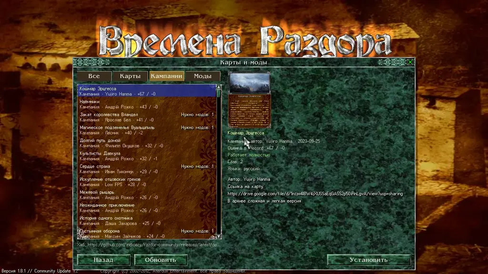

In the main menu, open the "Maps and Mods" window. It contains community maps, campaigns, and mods from the Discord server: 289 maps, 56 campaigns, and 25 mods. All of these can be installed directly from the game.

## Tabs

Entries are divided into tabs:

* **All**
* **Maps**
* **Campaigns**
* **Mods**

In the list, each entry shows its type (map, campaign, or mod), the author, the Discord rating (👍 and 👎), and its status. Entries are sorted by rating: the best are at the top. Entries without a Discord post are placed at the end, sorted by name.

## Search

Above the list, there is a "type to filter" field: enter part of a name (Russian or English) or an author's name, and the list will narrow down; the cross on the right or the Esc key will clear the field. The search also matches a mod's name: "evolu" lists every map made for Evolution.

A map or campaign that needs a mod names it in the list: "Needs mod: …" while the mod is missing, and "For mod: …" once it is installed.

## Open Entry

Select an entry, and its description will open on the right:

* an image;
* author, version, and date;
* Discord rating;
* how it works: "Works fully" or "Works partially" with an explanation;
* languages;
* description from the author's post on Discord.

If a map has its own image and its own story (an intro from the map itself), these are displayed, and the author's post text is shown below under the heading "From the author's post."

On a phone held vertically, the description opens as a card instead of the list: a full-width image with the title overlaid, followed by the author and details in frames, then the story and the author's post; "Back to list" returns you to the list.

## Installation and Removal

* **"Install"** downloads the entry along with any mods it requires.
* **"Remove"** removes the entry. A mod will not be removed as long as an installed entry requires it.
* **"Refresh"** at the bottom of the window re-reads the catalog.

## Updates

Each installed map or mod is compared with the catalog by the checksums of its files. When the Hub has a new version, the entry's row shows **"Update available"**. In the entry's details, the **"Update (size)"** button sits to the left of "Remove". Press it, and the new version installs over the old one.

* Saves and your own data stay as they are.
* If you are playing a mod that has been updated, the game reloads it when you close the Hub window.
* On a phone where the buttons do not fit in one row, "Update" shares the row with "Remove".

## Where maps come from

The catalog is taken from the community Discord server forums: the "mod-treasury" and "map-library" sections. Materials are published with permission from the server administrators, and each entry specifies the author with a link to their thread.

The catalog itself is located in the releases of [razdor-community](https://github.com/indicozy/razdor-community). Mods there are stored only as differences from the Community Update. Your game copy remains unchanged and is still required. Music in mods is re-encoded to Ogg Vorbis to keep download sizes small.

The window opens immediately: the list is taken from a copy saved during the last opening, while a new list is loaded in the background; without a connection, you will see the saved list and a "No connection: showing saved list" message.

## Playing a mod

In the New Game window, select a mod from the "Mod" list; it is located at the bottom of the window next to "Add map...". You can also select a mod in the main menu, see below. The game will run using the mod's data on top of the base game. Maps that require a mod are only visible when the mod is selected. Base game maps are shown at the end of the list in the "Base game maps" group: it is collapsed; click its header to expand it. Saves for each mod are stored separately. Green checkmarks for completed maps are also stored per mod: a map completed under one mod is only marked as such under that mod, while without a mod, the base game checkmarks are shown.

If an antivirus removed or damaged a mod's files, Razdor checks them when you choose the mod and restores them: from the mod's kept archive, or by downloading the mod from the catalog again. A message then appears. If the files cannot be restored (for example, there is no connection to the catalog), the mod does not start and the previous choice stays.

## Mod in the main menu

The main menu has a "Mods" button: on a computer it is a link in the bottom right corner, on a phone it is a tile in the bottom row, next to "Maps and Mods" and Discord. When a mod is installed, it shows "Mod: <name>"; without mods, it says "Mods".

Clicking the button opens the "Mod" list (the same as in the New Game window), even when no mod is installed. Selecting a mod in the list applies immediately.
* The list starts with the base game, then the installed mods, and ends with "Get mods…": it opens the "Maps and Mods" window on its "Mods" tab and does not change the mod played.
* A mod being built says "Preparing the mod…" instead of its name, and cannot be chosen.

If no mods are installed, the list holds the base game and "Get mods…".

## Partial entries

Some mods are marked as "partial." They provide their own modified game files (`DiscordTimes.exe` or `ddraw.dll`) that Razdor cannot use, or they are incomplete. Such mods can be played, but not everything the author created may work.

Some campaigns are also marked as "partial": they contain chapters that are not found in any other source.

## Removing or correcting an entry

Authors requesting to remove or correct an entry can do so by writing on Discord or by opening an issue in the [razdor-community](https://github.com/indicozy/razdor-community) repository.

:::note
Maps and mods are created by community authors; Razdor only collects them into a catalog and verifies that they open and are playable.
:::

:::tip
The Discord rating is the rating of the post on the server, not a Razdor rating.
:::
